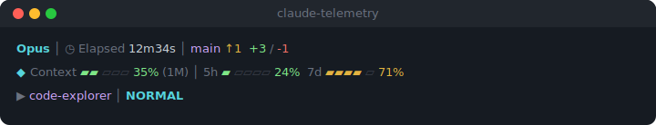

# claude-telemetry

Customizable multi-line status line for [Claude Code](https://claude.com/claude-code).

**"The status line you can trust"** — accurate, lightweight, never breaks.

<p align="center">
  
</p>

## Installation

### Via marketplace (recommended)

1. Add marketplace:

```
/plugin marketplace add jeongph/claude-telemetry
```

2. Install:

```
/plugin install claude-telemetry@jeongph-claude-telemetry
```

3. Run interactive setup:

```
/claude-telemetry:setup
```

This downloads the Go binary, configures your preset, and sets up the status line.

### Manual setup

1. Download the binary for your platform from [Releases](https://github.com/jeongph/claude-telemetry/releases/latest):

```bash
mkdir -p ~/.claude/statusline/bin
curl -fsSL "https://github.com/jeongph/claude-telemetry/releases/latest/download/claude-telemetry-$(uname -s | tr '[:upper:]' '[:lower:]')-$(uname -m | sed 's/x86_64/amd64/' | sed 's/aarch64/arm64/')" \
  -o ~/.claude/statusline/bin/claude-telemetry
chmod +x ~/.claude/statusline/bin/claude-telemetry
```

2. (Optional) Copy the example config:

```bash
cp claude-telemetry/config.example.json ~/.claude/statusline/config.json
```

3. Add to `~/.claude/settings.json`:

```json
"statusLine": {
  "type": "command",
  "command": "bash /path/to/claude-telemetry/scripts/run.sh"
}
```

4. Restart Claude Code

## Features

- **Remaining % display** — all bars show remaining capacity (like a battery), not usage
- **Preset modes** — compact (1 line), normal (2 lines), detailed (3 lines)
- **Auto user detection** — OAuth users see rate limits, API key users see cost
- **Git integration** — folder:branch, ↑push/↓pull, changes (+/-), untracked (?N), stash (≡N), worktrees (⎇N)
- **Rate limit countdown** — remaining time until reset with progress bar
- **Dynamic color thresholds** — green/yellow/red based on remaining %, customizable via config
- **Graceful degradation** — loading (···), partial failure (—), error messages instead of silent blank
- **Progress bars** — ▰▱ visualization, color-coded green → yellow → red
- **Adaptive width** — auto-drops lower priority sections on narrow terminals
- **i18n** — English, Korean, Japanese, Chinese (auto-detected)
- **NO_COLOR support** — respects `NO_COLOR` environment variable
- **Go binary** — single binary, no runtime dependencies, sub-10ms rendering
- **v1 fallback** — existing jq-based users keep working until they upgrade

## Sections

| Line | Section | Description |
|------|---------|-------------|
| 1 | Model | Current model name |
| 1 | Elapsed | Session duration (Nh Nm format) |
| 1 | Git | folder:branch ↑push ↓pull +add/-del ?untracked ≡stash ⎇worktrees |
| 2 | Context | ◆ Remaining context window % with progress bar |
| 2 | Remaining | ◆ 5h / 7d remaining % with reset countdown (OAuth, auto-detected) |
| 2 | Cost | Session cost in USD (API key, auto-detected) |
| 2 | Lines | Session lines added/removed |
| 2 | API Duration | Time spent waiting for API responses |
| 2 | Tokens | Input/output token details |
| 3 | Agent | Active agent name (shown only when active) |
| 3 | Vim | Vim mode indicator (shown only when active) |

Line 3 appears only when agent or vim mode is active.

## Setup

Run `/claude-telemetry:setup` in Claude Code for interactive configuration — it detects your language, downloads the binary, and walks you through preset selection.

Or edit `~/.claude/statusline/config.json` directly:

```json
{
  "preset": "normal",
  "language": "en",
  "colors": true,
  "bar_width": 5,
  "separator": " │ ",
  "user_type": "auto",
  "sections": {},
  "thresholds": {
    "context_warn": 50,
    "context_danger": 20,
    "cost_warn": 1.0,
    "cost_danger": 5.0
  }
}
```

### Presets

| Preset | Lines | Sections |
|--------|-------|----------|
| `compact` | 1 | Model, Context, Remaining |
| `normal` | 2 | Model, Elapsed, Git, Context, Remaining/Cost, Agent, Vim |
| `detailed` | 3 | All sections enabled |

### Section overrides

Use `sections` to override preset defaults:

```json
{
  "preset": "normal",
  "sections": {
    "tokens": true,
    "lines": true
  }
}
```

### Thresholds

Color changes at these remaining percentages (customizable):

| Remaining | Color |
|-----------|-------|
| > 50% | Green |
| 21–50% | Yellow |
| ≤ 20% | Red |

### Project-level config

Create `.claude-statusline.json` in your project root to override global settings per project:

```json
{
  "preset": "detailed"
}
```

## Removal

```
/claude-telemetry:remove
```

## Upgrading from v1

v2 is backward-compatible. Existing v1 config files work as-is. Run `/claude-telemetry:setup` to download the Go binary — your existing settings are preserved.

If you don't run setup, the v1 jq-based rendering continues to work via the built-in fallback.

## Requirements

- Claude Code
- `git` (optional, for branch/changes display)

## License

MIT
